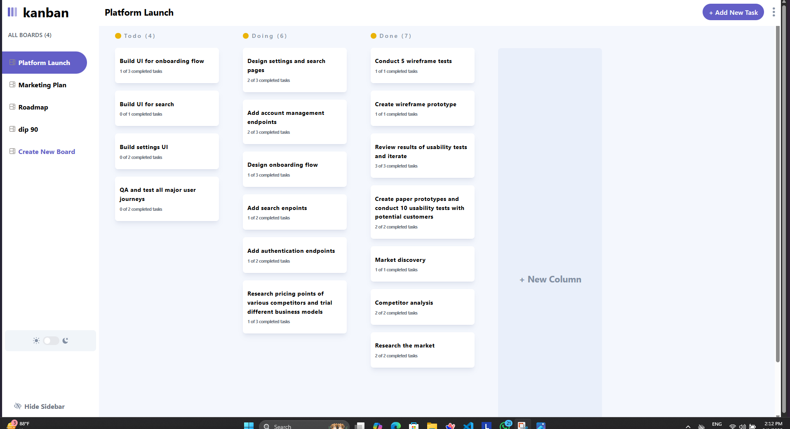
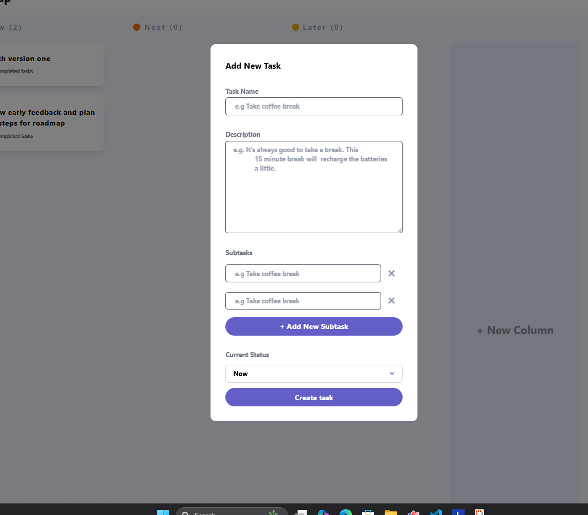

# 🗂️ Task Management App

A sleek and responsive task management tool built using **React** and **Tailwind CSS**. This project allows users to create boards, columns, and tasks with subtasks, helping organize workflows efficiently.

> 🚀 This is currently a front-end only application. In future updates, the app will support real-time data storage and user authentication using Supabase or Appwrite.

---

## 📸 Screenshots

| Board View | Task Modal |
|------------|------------|
|  |  |

---

## 🔧 Tech Stack

- ⚛️ React
- 💨 Tailwind CSS
- 🧠 Redux Toolkit
- 🔀 UUID for unique IDs
- ☁️ Supabase *(coming soon)*
- 🔐 Auth *(coming soon)*

---

## ✅ Features

- 📋 Create multiple boards with columns and tasks
- 📝 Add, edit, and delete tasks and subtasks
- 🎯 Drag and drop tasks across columns
- 🌙 Light/Dark mode toggle
- 🔄 Persistent state with Redux (currently in-memory)

---

## 🚧 Upcoming Features

- 💾 Backend integration with Supabase or Appwrite
- 👤 User authentication (sign up, login)
- ☁️ Real-time data storage and retrieval
- 📲 Mobile responsiveness improvements
- 🧪 Unit and integration tests with Testing Library

---

## 🛠️ Getting Started

### 1. Clone the Repository

```bash
git clone https://github.com/Dip290703/Task-Management.git
cd Task-Management
